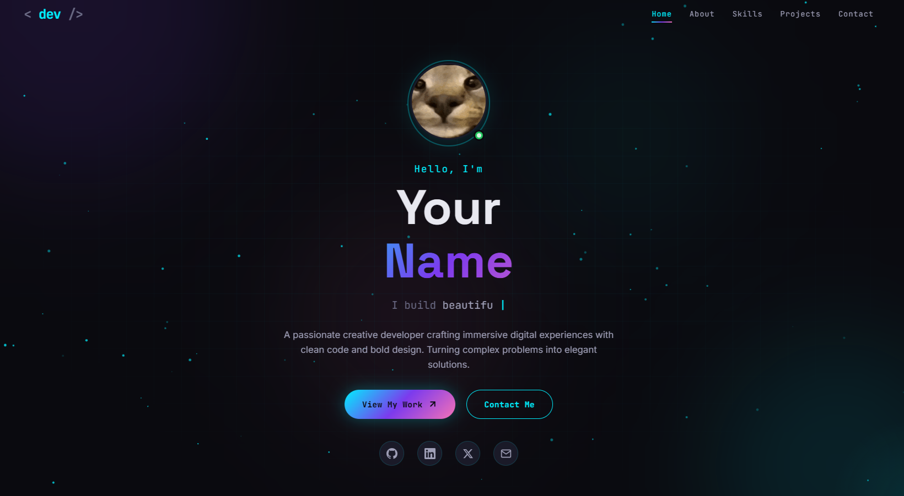

# 🚀 Creative Developer Portfolio

A stunning, modern portfolio website built with pure HTML, CSS, and JavaScript.  
Featuring a cyberpunk aesthetic with particle animations, custom cursor, smooth scrolling, and responsive design.

## ✨ Features

- **Custom animated cursor** with glow effect
- **Particle background** (interactive with mouse)
- **Preloader animation**
- **Typing effect** in hero section
- **Scroll reveal animations**
- **Animated skill bars**
- **Animated counters** for stats
- **Magnetic buttons**
- **3D tilt effect** on cards
- **Mobile responsive** with hamburger menu
- **Smooth scrolling** navigation
- **Contact form** with UI feedback
- **Neon/cyberpunk color scheme**

## 🛠 Technologies Used

- HTML5
- CSS3 (Custom properties, Flexbox, Grid, animations)
- Vanilla JavaScript (ES6+)
- Google Fonts (Inter, Space Grotesk, JetBrains Mono)

## 🚀 Getting Started
1. **Clone the repository**
git clone https://github.com/kl6388760-prog/portfolio-site.git

2. **Open `index.html`** in your browser

No build tools or dependencies required.

3. **Customize your content**

- Replace your name, description, projects, social links in `index.html`
- Update the avatar image in `assets/imgs/hacker.gif`
- Adjust colors and fonts in `style.css` (CSS variables at the top)

## 📝 Customization

### Change Name
Edit the `<h1>` section in `index.html` and other occurrences.

### Update Projects
Modify the project cards inside the `<section id="projects">` block.

### Change Social Links
Find the `.hero-socials` div and update `href` attributes.

### Color Scheme
Modify CSS variables in `:root`:
:root {
--accent-1: #00f0ff;
--accent-2: #7c3aed;
--accent-3: #f472b6;
}

## 📱 Responsive

Works on all devices: desktop, tablet, and mobile.  
The mobile menu and cursor effects adapt automatically.

## 📄 License

Feel free to use for your own portfolio. Attribution is appreciated but not required.

## 🤝 Connect

- GitHub: [@your-username](https://github.com/your-username)
- LinkedIn: [Your Name](https://linkedin.com/in/your-profile)
- Twitter: [@your-handle](https://twitter.com/your-handle)
- Email: your@email.com

---

Made with ❤️ and lots of code.
